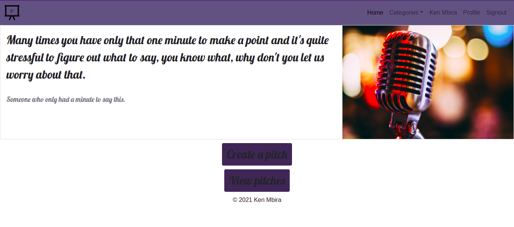

# PITCH ARENA

This is an online platform for users to showcase their ideas for short but effective proposals. The platform measures the quality of the submissions through the voting which is also done by the users.

## Contributors
1. Ken Mbira

## Technologies Used
1. Python
2. HTML
3. CSS
4. Bootstrap
5. JavaScript
6. Flask
7. SQLAlchemy Database
8. Jinja
9. Figma design tool for the mockup (design)[https://www.figma.com/file/4763G0ng5yxQCrTqZynfT4/Pitch-Arena?node-id=0%3A1]

## Set Up Instructions
Follow the following instructions:
1. Designate a directory to house the app.
2. Within that directory run <code>git clone https://github.com/Ken-mbira/PITCH_ARENA.git</code>
3. Then navigate inside the directory PITCH_ARENA and create a virtual environment. To do so run <code>python3 -m venv virtual</code> followed by <code>source virtual/bin/activate</code> to activate the virtual environment.

### Dependencies
To run the application locally, you have to make sure you have all dependencies specified in the requirements.txt file or just run: 
'pip install -r requirements.txt'

After this create a .env file in the root directory of the app and within it paste the following:
- <code>export FLASK_APP=manage.py</code>
- <code>export FLASK_ENV=development</code>
- <code>export SECRET_KEY=1234</code>
  
### Running The App
After all dependencies have been installed successfully on the terminal run <code>flask run</code>

## Application Description
The application makes use of SQLAlchemy database to store the details using 3 tables: 
- users
- comments
- pitches

The three are connected in that it can be known which user made which pitch or which comment or which pitch was a comment made about.
The app shuffles data between the 3 tables and is able to achieve the following user stories:
- A user can create an account and login for special features such as pitching
- A user can create a pitch and designate it to any category of choosing
- A user can view all pitches and their comments
- A user can comment to any pitch
- A user can view their own pitches

## Known Bugs
Currently all functionality is okay but as always there is room for improvement especially on the design sector. Feel free to contact me if you have any corrections or ideas to make this better.

## Future Improvements
I'm thinking of adding a user profile with a photo section, adding deleting functionality for either a pitch or a comment, and an administration status for a select user.

## Contact Information
In case of any queries or suggestions you can reach me through the following:
1. Phone : 0758926990
2. Git-Hub : Ken_mbira
3. Twitter : Ken Mbira
4. LinkedIn : Ken Mbira
5. email : mbiraken17@gmail.com

## Licence Information
MIT License

Copyright (c) [2021] [Ken-Mbira]

Permission is hereby granted, free of charge, to any person obtaining a copy of this software and associated documentation files (the "Software"), to deal in the Software without restriction, including without limitation the rights to use, copy, modify, merge, publish, distribute, sublicense, and/or sell copies of the Software, and to permit persons to whom the Software is furnished to do so, subject to the following conditions:

The above copyright notice and this permission notice shall be included in all copies or substantial portions of the Software.

THE SOFTWARE IS PROVIDED "AS IS", WITHOUT WARRANTY OF ANY KIND, EXPRESS OR IMPLIED, INCLUDING BUT NOT LIMITED TO THE WARRANTIES OF MERCHANTABILITY, FITNESS FOR A PARTICULAR PURPOSE AND NONINFRINGEMENT. IN NO EVENT SHALL THE AUTHORS OR COPYRIGHT HOLDERS BE LIABLE FOR ANY CLAIM, DAMAGES OR OTHER LIABILITY, WHETHER IN AN ACTION OF CONTRACT, TORT OR OTHERWISE, ARISING FROM, OUT OF OR IN CONNECTION WITH THE SOFTWARE OR THE USE OR OTHER DEALINGS IN THE SOFTWARE.

